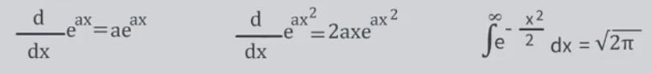
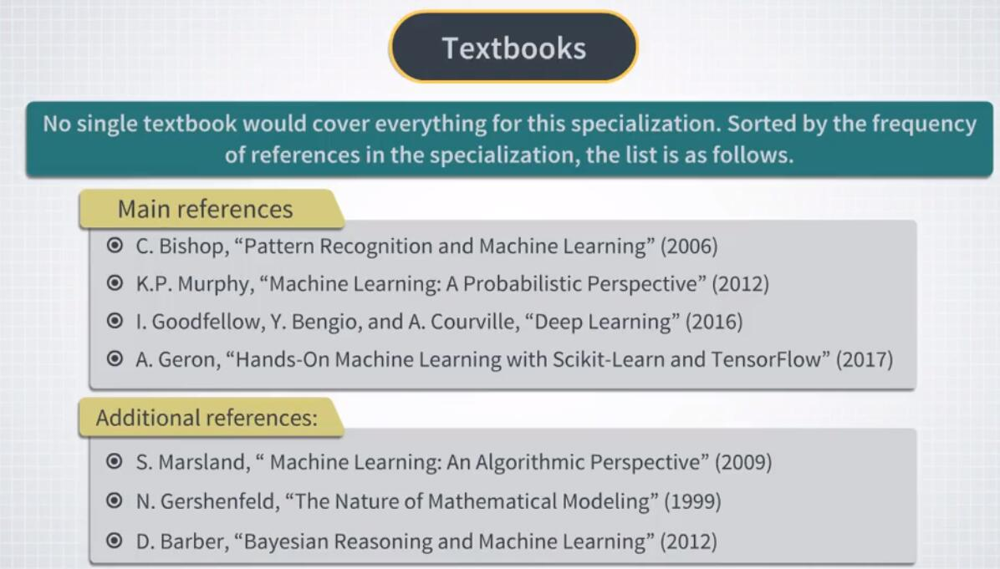

# 1.1.1 “金融机器学习与强化学习”专项简介

## 欢迎

你好，欢迎观看 Coursera 的金融机器学习专项。

我的名字是 Igor Halperin，我是纽约大学 Tandon 工程学院的研究教授。

我将成为这个专项的导师。

我会稍微谈谈自己，但首先，我想谈谈你将从这个专项中得到什么。

首先是关于这个专项本身。

简而言之，这是机器学习的专项，专注于机器学习在金融领域的应用。

这与通常使用各种工业应用来教授机器学习的其他课程不同。

关于这种专项的第二个非常重要的一点是它的目标受众。

我假设你要么是金融专业人士，要么计划在不久的将来成为金融专业人士。

因此，这种专项是为那些从业者或未来从业者设计的，它们从事或计划从事金融工作，并希望从头开始学习机器学习，但使用金融问题来开发你的技能。

然而，金融来源于数字和预测。

那么，为什么我们不从一开始就使用金融数据来学习机器学习，而不是使用与金融数据关系不大的示例？我想提出的第三点是这个专项的示例和作业。

因为这是面向从业者的专项，所以我尽力避免与现实生活无关的毫无意义的练习。

例如，为此，我们不会做股票价格预测或股票指数预测等事情。

原因是即使你可能遇到过许多讨论机器学习应用于此类问题的博客或研究论文，但它们没有实际用途。

因此，为了最大限度地发挥它对你的实用性，我们只会在实用的示例中看到这个专项。

那么你对这个专项的看法是什么呢？首先，你将从头开始很好地理解核心概念和最重要的机器学习算法。

其次，你将不是抽象地学习所有这些，而是​​以非常实际的方式学习。

我们将掌握许多不同类型的金融数据，并使用多个机器学习算法来处理相同的数据。

你不仅将学习经典机器学习算法，还将获得神经网络的扎实理解和实践经验，尤其包括最近风靡全球的所谓深度神经网络。

因此，你将对金融数据以及不同算法对此数据的执行情况，有一个良好的直觉。

你将了解如何应用 Python 机器学习包（如 scikit-Learn 或 TensorFlow）来为量化交易，资产管理，银行和其他金融领域的应用程序，构建机器学习模型。

你将能够通过一系列有趣和相关的项目，给你的潜在雇主留下深刻印象，这些项目涉及机器学习在实际问题中应用。

更重要的是，如果你的企业需要，你将能够利用你所学到的知识库来构建新的机器学习模型。

我提到的这最后一件事让我想到了这个专项的最后但同样重要的一部分。

机器学习是一个非常活跃的领域。

今天学校教授的最前沿方法将在明天过时。

因此，重要的是，机器学习的工业从业者应该能够理解机器学习中的论文，并且能够实现它们。

学习它的最好方法是阅读机器学习论文。

因此，我们的编程作业通常会引用原始出版物，可用于深入挖掘我们将要涵盖的主题。

此外，我将在每周阅读清单中提供原始出版物的引用，这将有助于你更广泛地了解所涵盖的主题，并在阅读机器学习论文的同时开发一些实践。

因此，在完成金融机器学习专项之后，这将是你的三个主要内容。

在下一个视频中，我们将更多地讨论这个专项的结构。

## 专项的目标

好的，让我们从最后停止的地方继续，并谈谈你在此专项中的高级目标。

你的第一个目标应该是学习机器学习的核心概念，例如机器学习的类型，交易计数的概念，测试集，所有特征分类，等等。

其次，你想了解具体的机器学习算法，如逻辑回归，支持向量机，决策树以及解决金融问题的解决方案。

此外，你希望了解神经网络的更多信息，可能是因为你听到了很多深度学习的内容，并且你想了解神经网络和深度学习的内容以及它们在金融中的用途。

接下来，你希望获得，在金融问题上使用 Python 机器学习库的实践经验，特别是经典机器学习算法库 scikit-learn ，以及用于神经模型的 TensorFlow 等。

最后，你想知道在完成此专项之后，你将如何扩展你的知识并了解更多知识。

以上所有内容都是我们的目标，我们将通过本专业的课程顺序完成这些目标。

让我解释一下我们将在每一门课中做些什么。

我们的第一门课程是一门入门课程，我称之为金融机器学习概览。

本课程将帮助你掌握机器学习的基本概念，并了解金融学中的机器学习与科技行业的机器学习有何不同。

你将学习一些简单的机器学习算法，我们将使用它们来分析股票收益，公司基本面，银行报告和其他金融数据。

所有这些都带有实际问题的示例。

我将向你展示实现这些简单算法的 Jupyter 笔记本，然后你将使用不同算法中的不同数据扩展它们。

在第一门课程中，我们将主要使用 scikit-learn 和其他一些软件包来实现我们的机器学习解决方案。

同时，我们将介绍 TensorFlow，一个非常强大的用于机器学习的 Python 软件包，由 Google 在两年前开源。

虽然我们对 TensorFlow 的主要兴趣在于，它用于神经网络的功能。

我们将使用 TensorFlow 从大多数简单示例开始，例如线性回归或逻辑回归。

我们将使用神经网络，在第一个课程中看到它们如何生效，并建立我们简单的神经网络来分析公司收益和银行对账单。

在本课程中，我们将每周进行家庭作业，包括编程作业和可选阅读。

最后的课程项目将把几种监督学习算法应用于银行报告数据。

如果你不知道监督学习这个词的含义，请不要担心，我们会尽快学习。

你的课程最终得分将计算为，你每周家庭作业和最终课程项目的累积分数。

完成第一门课程后，四门课程将涵盖机器学习范式的主要内容。

现在，让我为你清点。

它们被称为监督学习，无监督学习和强化学习。

每个后续课程都将在深度和考虑的影响方面延伸我们的第一个课程。

在我们的第二门课程中，我们将详细介绍监督和无监督学习，可以熟悉属于这些类型的机器学习的许多关键算法。

我们将讨论各种类型的回归和分类问题，并了解如何使用逻辑回归，支持向量机或各种类型的决策树等方法来解决这些问题。

然后，我们将转向无监督学习，并讨论数据分析和数据可视化的方法，如主成分分析及其扩展，聚类方法等。

我们还将研究神经网络，并了解它们如何用于处理监督和无监督学习的相同类型的任务。

在金融方面，我们将关注许多经典的金融问题，例如市场和制度预测，股票收益预测，投资组合优化等，并展示机器学习如何应用于这些任务。

如果你只对监督学习或无监督学习的金融影响感兴趣，前两个课程应该为你提供强有力的基础知识，帮助你理解这些领域的核心概念和主要方法。

因此，在完成这两门课程后，你将能够在现实生活中继续使用它们。

我个人的观点是，机器学习在金融领域最令人着迷的地方是强化学习。

我们将在前两个课程中接触强化学习，并在第三个课程全面投入强化学习，及其金融影响。

在本课程中，我们将讨论使用强化学习来解决诸如投资组合优化，最优交易，期权定价和风险管理等金融问题。

这第三门课程比前两门课程技术更先进，我们会有更多的数学，但不是很多。

这门课程与强化学习的其他课程的主要区别在于，我们不会花费时间谈论强化学习的传统例子，如井字棋或机器人学。

相反，我们将从一开始就跳到金融问题，并学习强化学习的经典方法，例如使用金融问题的着名的 Q 学习。

这将是一个实践课程，你将实现此类算法，并了解它们在实践中的工作方式。

在本课程的课程项目中，你将探索使用强化学习获得的市场动态的简单模型。

在那之后，在我们的最后一门课程，我们将深入探讨我们在第三门课程中提到的强化学习的主题。

通过第四门课程，我们将专注于更高级的主题，但它的技术性将低于第三门课程，并将作为所选主题的概述进行组织。

第一类主题将侧重于金融的基本概念，如市场均衡，无套利，可预测性等，以及强化学习方法如何为这些概念提供新观点。

我们还将更多地讨论强化学习中的市场建模线索。

最后一门课程的第二部分，将概述强化学习在高频交易中的应用，点对点借贷中的信用风险以及加密货币交易。

最后，在我们继续本专项的第一门课程之前，我需要讨论的最后一件事是本课程的先决条件，教科书和课程资源。

我们在下一个视频中谈谈它。

## 专项的预备条件

现在让我谈谈这个专项的先决条件。首先让我从编程部分开始。我假设你至少知道一些 Python，并且已经使用过或至少看过 Jupyter 笔记本。如果你不熟悉 Jupyter 笔记本，请在本周的阅读列表中查看教程参考。我还假设你熟悉其他 Python 库，例如 numpy 和 Pandas。

并且不会假设事先有 TensorFlow 知识，因为 TensorFlow 将在课程中逐步引入。

现在让我们谈谈数学部分的先决条件。

这是我希望你知道的。首先，机器学习使用大量的线性代数。所以我希望你熟悉线性矩阵方程，特征值分解，逆矩阵和其他相关概念。我还假设你了解基本概率理论。例如，你熟悉高斯分布，指数分布或二项分布。基本概率规则，如基础引理，你也知道一些基本的统计。最后在数学方面，我假设你了解基本的微积分，尤其包括复合函数的微分规则。所以像这样的公式，或者像这样的公式，或者甚至那样的公式都不会让你困惑。如果他们这样做，请复习你的微积分知识。作为我的科学英雄之一曾经说过，数学不应该站在你和你想要解决的问题之间。恰恰相反，一旦你知道如何使用它，它应该能够帮助你。

顺便说一下，在机器学习中需要了解多少数学问题，是各种讨论板上的热门话题。最近我遇到了一位目前在机器学习领域工作的前物理学家撰写的非常可爱的帖子。我强烈建议你阅读这篇文章，这里是链接。

在我这边，我可以确认这个人所说的一切。都是物理学家在数学方面解决问题的方式。如果我不得不用几句话来浓缩，我会这么说。当你遇到一个新的机器学习模型时，无论是在我们的讲座，书籍还是原始论文中，都要从摘要或其他等价内容开始。

如果模型作用的陈述吸引了你的兴趣，并且你想要了解更多信息，请浏览论文的许多方程式。并确保你明白他们的意思，而不是他们是如何获得的。对主要公式进行某种冥想。观察等式左边的数量，以及右侧出现的术语。例如，他们是怎么回事？指数还是对数？然后假设所有方程都是正确的，并且可用的实现也是正确的。然后直接进行模型的动手操作。

你可能希望首先使用你理解的数据为模型提供信息。例如，使用纯随机数据，甚至是常量数据，来查看它是否通过了某种形式的合理性检查。如果是，则将模型提供给你想要探索的实际数据。

当你得到结果时，你可能会喜欢它们或者不喜欢它们。但最有可能的是，你会发现一些特定的行为，你会对此有疑问。只有这样你才能回到主要部分并阅读数学。现在长话短说，如果你从数学开始，只需继续前进，如果需要，稍后再回来。

除非你有无限的时间预算，否则这对我们这门课程及其他课程都是实用的建议。但如果你不这样做，这是现实生活中最常见的情况，我刚才描述的方法可以为你节省大量时间。

最后，让我们谈谈金融方面的先决条件。

这将非常简短，因为事实上我并不认为你对金融有任何具体的了解。并且非专业人员也能正确解释此专项中讨论的所有金融概念或问题。

好的，所以我在这里介绍了我想说的大部分内容，作为对这种专项的一般介绍。现在让我以推荐文献清单结束。有许多关于机器学习的优秀教科书，但没有专门针对金融机器学习的教科书。所以我为这门课程所做的是结合多种来源，包括 Bishop，Murphy，Goodfellow 的书籍部分，以及 Geron 最近的一本书。我喜欢的其他几本书，Marsland 的书和 Gershenfeld 的另一本书。除了教科书，我还使用了原创出版物，我自己的研究，行业论文，博客，维基百科，讨论论坛上的帖子等等。简而言之，我发现任何类型的数字信息都有助于本课程。作为一项规则，每当我基于任何单一来源的讲座的任何重要部分时，我总是会引用原始来源，以便你可以随时查找更多详细信息。同样在这种情况下，我通常会保留原始出版物的符号，或者只是稍微调整一下来利用更常见的约定。因此，如果你需要，你可以随时返回，从离开讲座的地方继续。

好的，所以我认为，这最终只是我在这个专项的介绍部分中要说的。在下一个视频中，我们将开始我们的第一个课程。我希望你会发现它有用而有趣，但如果你觉得我讲得太慢，太快，太深或太浅，没有涵盖一些主题，或者相反，其他一些没有趣的话题占了太长时间，等等，请在课程论坛上分享你的想法。祝你好运，记住，机器学习从这里开始。再见。
