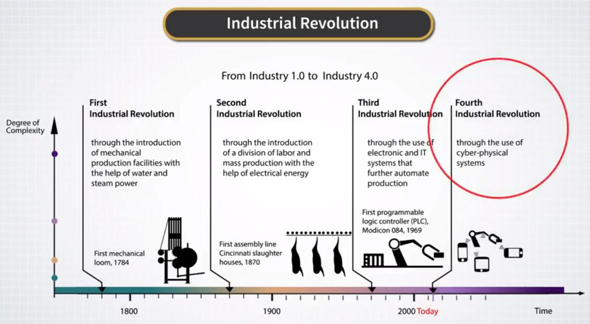

# 1.1.2 人工智能与机器学习

## 第一部分

如果我们考虑在过去几年中，技术，科学和商业新闻的关注中心处的所有主题，那么很难摆脱这个印象，人工智能可能位于此列表顶部，因为它似乎令人着迷，无论是媒体还是公众都是如此。

实际上，我们每天都在媒体上读到人工智能的另一个奇迹。

我们读到了自动驾驶和电脑世界赢得围棋比赛的冠军。

我们读到谷歌这样的公司，正在努力将人工智能和机器学习放在他们的业务中。

我们不仅读到了人工智能和机器学习，我们已经在日常生活中与他们共生。

当你在智能手机上发短信时，人工智能会纠正你的拼写。

实际上，当你使用它时，有时你会觉得人工智能不是很聪明，但这可能是另一个讨论的话题。

另一个例子是虚拟助手，例如 Siri 或 Alexa。

更简单的垃圾邮件过滤器最近有了很大的改进，以至于我们有时会忘记我们在日常邮件中没有收到太多垃圾邮件，这种安慰是由人工智能和机器学习算法提供的，这些算法在幕后工作以保护我们。

简而言之，人工智能来到我们的生活中并繁衍，这个过程似乎在时间上指数性增长。

人工智能对整个社会的不断增长的影响是如此巨大，以至于现在许多人都在谈论人工智能给我们带来的第四次工业革命。

这就是谷歌联合创始人谢尔盖·布林所说的，“人工智能的革命是深刻的，它让我感到惊讶，即使我坐在那里。”还有一些思想家，如着名的物理学家斯蒂芬霍金认为，人工智能可能最终会赢得并接管人类。

其他一些思想家，比如着名的企业家埃隆马斯克，相信未来不会那么黑暗，最终人类和机器人最终将会处于某种共生关系。

那么，什么是人工智能和机器学习？我认为，在广大公众的眼中，机器学习的话可能与机器人的照片相关联，机器人坐在一堆书上，读另一本书以了解更多信息。

而事实上，如果我们假设在阅读完书籍和学习之后，机器人 Sonic 将会出去做一些有用的事情，这张图片可能并不能很好描述整个过程。

但是，作为科学家，极客们，我们希望更深入一点，了解它如何在更技术层面上发挥作用。

好的，但是我们从哪里开始呢？对于新领域的新手，第一项任务通常是理解术语和流行语。

2017年4月，kdnuggets.com 发现机器学习的谷歌搜索已经首次超过了大数据的搜索。

更重要的是，人们可以注意到，AI，机器学习，数据科学，大数据等术语不仅在可比较的范围内发声，而且人们有时会将它们用作彼此的替代品。

我的一位朋友，他是一名统计学家，最近告诉我，虽然他在过去的十年中进行了类似的研究，但大约六年前，他的领域开始被称为机器学习。

大约三年前，它现在被称为人工智能。

所以，让我首先向你介绍一个简短的术语表，这将是我们在这里的定义。

首先，人工智能指的是制造机器的科学，这些机器能够在需要模仿人类认知过程的特定任务上，实现人类水平的表现。

例如，面部识别，语音识别和翻译，销售假期的聊天机器人等等。

现在，什么是机器学习？机器学习是人工智能的一个子领域，专注于教授计算机直接从数据开始执行任务的算法，而不是为任务明确编程。

接下来，数据挖掘使用机器学习技术在数据中查找可操作的模式。

此外，当人们谈论大数据时，他们通常会参考大量结构化数据挖掘，即数字或非结构化数据集，如文本，图像，语音等。

最后，数据科学是应用统计学和机器学习来帮助货币化信息和数据的人们新兴行业的名称。

> 从国内的视角来看：
>
> AI 和 ML 的定义与课程完全一致。但是 AI 一般指“基于 ML 的 AI”，也就是由数据驱动的 AI。其它种类的 AI 几乎绝迹了。
> 
> 数据挖掘更像是“结构化机器学习”。
> 大数据和算法无关，指的是“储存和处理海量数据所用的平台”，一般代表 Spark、Storm、Hadoop 这种东西。
> 
> 数据科学包括关于数据的一切，包括机器学习、统计学、数据可视化等等，但不包括 AI 里的非数据的部分。

这里要注意的关键点是机器学习是所有上述领域的核心要素。

任务学习是计算机用来了解外部世界的东西，就像人类为了同一目的而使用数学和物理学一样。

事实上，就其应用而言，机器学习与人工智能的现代解释非常相似，有些人开始使用术语机器智能，来指代在该领域中运营的众多创业公司的业务计划。

因此，我们已经涵盖了基本术语，特别是理解现代人工智能和机器学习是两个密切相关的领域，为正在进行的第四次工业革命提供动力。

在下一个视频中，我们将更深入地了解 AI 和机器学习实际是什么。

## 第二部分

现在，让我们更加技术化，并介绍 Russell 和 Norvig 在经典教科书中定义的人工智能概念。

根据他们的定义，人工智能研究智能体，他们感知他们的环境并执行不同的行动，来解决涉及模仿认知功能的任务。

实际上，由于这些智能体需要在软件和硬件中实现，因此我们将使用智能体一词作为可能的软件和硬件架构组合的统称。

以及学习执行这些特定任务的算法。

人工智能有许多短期和长期目标，对应于各种各样的任务。

我们一个一个地介绍它们。

第一个目标是教计算机使用数据，物理科学等经验。

我们可以将此目标称为感知和学习的目标。

第二个目标是教 AI 智能体为未来做计划，实现目标并采取行动实现这些目标。

人工智能的这两个目标或子领域构成了机器学习。

换句话说，机器学习正是这一点，是一般人工智能研究的一个子领域，专注于从数据中学习和实现目标的任务。

我们的专项分别将专注于人工智能的这些任务。

仍然为了完整起见，我想简要概述一下 AI 的其他子领域，这些子领域不是机器学习，而是经常使用机器学习来实现目标。

其中之一是将知识表示为一组对象和关系的目标。它是被称为本体的东西。

另一个是模仿人类逻辑推理的自动推理的目标。

最后，自然语言处理（简称 NLP）的目标是理解书面和口头的人类语言。

所有这些都是现代工业为导向的 AI 的目标，有时在学术文献中被称为弱 AI 或应用 AI。

这些技术已经对许多行业产生了巨大影响。

它们使用人工提供的算法来操作，通常可以调优，以便在一个预先指定的任务上运行良好。

例如，你不能对 AI 智能体这样说：“出去找你自己做的事情。”在这种情况下，现代 AI 不会理解你。

这种更复杂，更人性化的认知任务是人工智能的长期目标，有时被称为广义人工智能目标或简称 AGI。

这些目标包括通过建立自己的世界的所有模型，使智能体自主学习。

这些智能体将能够形式化子符号信息。

例如，Yann LeCun 深度学习进化之父之一提到，“他拿走了他的包并离开了房间”这一短语特别暗示了这个人走出了门，而不是，例如，跳出窗外，或传送到另一个星球。

这是子符号信息的一个例子，现代计算机仍然学着感知它。

其他更为遥远的任务包括创造力，好奇心和惊喜的算法理论，正如另一位深度学习的基础之父 Juergen Schmidhuber 所追求的那样。

最后，根据着名企业家和未来学家雷·库兹威尔（Ray Kurzweil）的说法，人们预计人工智能将在 2,045 能够解决任意的智力任务。

在这短暂的未来之后，让我们回到现在，再次考虑我们介绍的 AI 智能体的定义。

根据它，智能体执行两项任务。

首先，他们直接通过传感器或通过从磁盘读取数据，来感知物理世界。

其次，它们有助于解决各种任务。

这些行为可能有所不同。

例如，它们可以一劳永逸地固定，也可以改变。

这些操作可能会也可能不会改变智能体运行的环境。

当然，主要问题是如何选择正确的方向。

这个问题的概念性答案来自理性 AI 智能体的概念。

Russell 和 Norvig 的书将其定义如下。

“对于每个可能的感知序列，理性只嗯呢该题应该选择一个行动，预期会最大化它的表现度量”，根据感知序列提供的证据以及智能体具有的任何内置知识。

让我们在同一本书中考虑的真空清洁器的例子中说明它。

因此，我们假设让机器人做清洁，机器人立即响应并开始工作。

它需要什么？首先，清洁机器人知道环境的地理位置。

他们可能被认为是先验知识。

其次，机器人最初不知道自己的位置或污垢的位置。

因此，无论什么时候，机器人的第一项任务是察觉它的位置，并查明该位置是否包含污垢。

最后，假设清洁区域的数量是表现指标，机器人应清洁尽可能多的区域。

最后，机器人必须让电池够用，才能在清洁工作完成后返回充电站。

理性智能体的概念是机器学习作为人工智能子领域的核心。

我们可以在高层次上说，我们在这个专业领域所做的就是研究各种理性的金融 AI 智能体。

这些智能体学会了解环境。

这是为了消化金融数据，有时是非金融数据，并执行某些操作来最大限度地提高某些表现指标。

在下一个视频中，我们将详细介绍机器学习的目标和类型。

