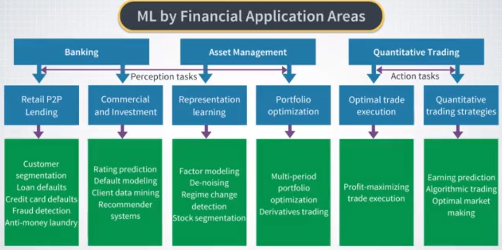
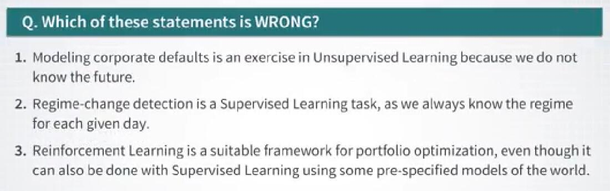
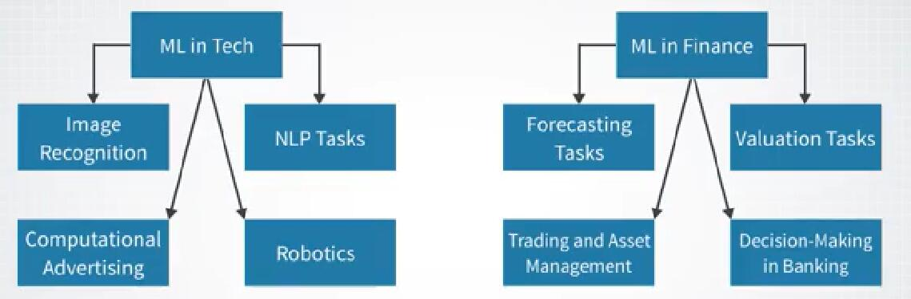
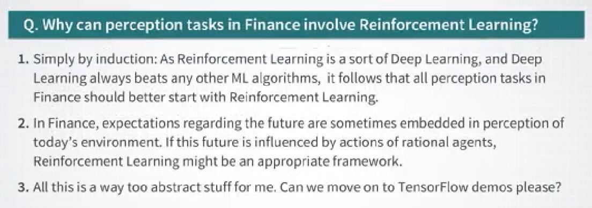

# 1.1.4 金融和科技中的机器学习

## 第一部分

那么到目前为止我们在这门课程中做了什么？我们从最顶层开始，了解机器学习和 AI 之间的关系。我们还建立了机器学习类型的景观，并简要介绍了它们对技术的影响。现在，我认为现在是时候更接近我们专项的主题，并首先看一下专门针对金融的机器学习。因此，让我们从上一个视频中的不同类型机器学习的应用图开始，并在此次重新绘制它仅用于金融应用。

让我们从回归开始作为典型的机器学习问题。我个人认为，在金融行业工作近 20 年后，回归是金融领域最常用的机器学习技术。股票收益，市场，投资组合，信用损失和许多其他问题的预测，相当于不同类型的回归。

另一类主要的监督学习算法，分类，也广泛用于金融。例如，它用于诸如贷款违约模型和信用评级预测，信用卡欺诈和反洗钱等任务。在本课程的后期，我们将分析金融领域的一些有趣的监督问题，包括股票保险预测，公司收益和银行亏损。在本专项的下一课程中将考虑更多的示例和方法。

现在，我们来谈谈金融领域的无监督学习。让我们从聚类我们的项目开始。他们的应用听起来或多或少都很明显。例如，这些问题表明，股票，信用卡持有人或机构客户的细分都是聚类方法的经典案例。表示学习也广泛用于金融领域。因子模型或主成分分析等方法将是表示学习的例子。机器学习方法的其他示例是制度改变检测和缺失数据的估算方法。这些将是我们将在本专项的第三门课程中详细研究的主题。最后，让我们谈谈强化学习在金融中的使用。直接强化学习用于处理策略优化问题，尤其用于最佳交易执行和资产管理。通过逆强化学习得到的结果，我不知道金融业中存在任何现有的工业影响。但另一方面，这是我个人认为最令人兴奋的话题。

这样做的原因是逆强化学习涉及从行为中学习目标。对于金融领域的许多问题，这是一个非常基本的问题。例如，任何可以了解信用卡持卡人偏好的见解，都可以用来为他们提供更好的产品。另一个例子可能是通过所谓的效用函数，交易对手或其他市场代理吸引目标，以便将其用于我们自己不断变化的策略和决策。我们将在本专项的最后一个课程中，更多地讨论直接和逆向强化学习。在本课程中，除其他事项外，我将向你展示如何使用逆向强化学习来推断，支付给名为联邦存款保险公司的政府机构多少正向保险费，可以培养美国银行。

但是现在，让我们回到金融机器学习的高级概述。

如果我们看一下在不同的金融领域中常用的机器学习方法，我们可以得到不同的观点。

我们在此专项中专注的三大金融领域是银行业务，资产管理和量化交易。

让我们从银行业务开始吧。首先，零售银行在功能上类似于点对点或 P2P 借贷。这些业务最常见的机器学习任务是信用损失预测，客户细分，欺诈检测和反洗钱。

其他类型的银行业务是商业和投资银行业务。与零售银行业务不同，它涉及企业客户而非个人。银行业的典型机器学习任务分别是企业违约或评级的预测，客户数据挖掘，客户推荐系统等等。

现在，让我们来看看资产管理中出现的机器学习任务。

首先，有大量的任务都属于更广泛的表示学习。其中，我们可以列举因子建模，权益估计，相关矩阵，制度变化检测和股票聚类。用于资产管理的机器学习的其他应用，处理多周期投资组合优化，以及涉及基于强化学习的方法。最后，让我们来看看用于量化交易的机器学习用法。在这个领域，强化学习用于优化交易执行，以便市场以最小的方式移动，并使利润最大化。

许多其他机器学习算法用于解决量化交易策略的某些子任务。例如，回归方法用于预测收益，股票收益或市场流动性。强化学习方法用于最佳营销。

所有这些都可能使得，金融中的机器学习与技术中的机器学习没有太大的不同，只要它使用类似的监督，无监督和强化学习方法。唯一的区别是应用领域。但正如我们将在下一个视频中看到的那样，现实情况有点复杂。并且这两个在焦点和所涉及的算法方面都存在一些重要的差异。我们接下来再讨论一下。

## 第二部分

现在，让我们比较金融中的机器学习与技术中的机器学习。首先，让我们从技术中的机器学习应用开始。

技术中机器学习的最常见应用是图像识别和各种自然语言处理任务，如文本分类，情感分析，机器翻译等。

根据我们的机器学习和感知任务以及行为任务的规范，这些应用属于感知任务类。这是因为对于这些任务，只有一个固定的单一动作，算法必须很好地执行。例如，为了将文本从一种语言翻译成另一种语言，这个问题通常使用监督学习来解决，有时与无监督学习相结合。我们可以提到计算广告，机器人和自动驾驶中的各种问题。对于这项任务，强化学习提供了最自然的框架，并用于实践中的方法，以及基于监督和无监督学习的方法。现在让我们看看金融中有什么样的感知和行为任务。首先，金融中有许多类型的预测问题属于感知任务类。它们尤其包括证券价格的预测，例如股票，债券或商品。对于这个问题，监督和无监督学习是选择的方法。

金融中的其他预测任务包括预测个体参与者的行为。例如，我们可能想要预测公司的行为，例如股息支付，违约，合并等。

另一个问题是预测带有充足违约和贷款，欺诈或反洗钱的个人的行为。事实证明，对于这样的预测任务，我们不仅可以使用监督和无监督的学习，还可以使用强化学习。金融中常用的其他典型感知任务涉及估值。例如，股票，期货，商品和债券等资产的估值与预测问题有关，但与之不同。

金融中另一个经典的估值问题是衍生定价。尽管衍生品定价的最传统方式，是通过使用参数化随机模型，但问题很自然地适用于机器学习。在本专项的最后一个课程中，我们将看到强化学习如何用于金融衍生品定价。

现在让我们在这里注意一些有趣的事情。请记住，在技术中，感知任务使用监督和无监督学习来解决，而强化学习仅用于行为任务。然而，在金融学中，听起来甚至感知任务都可以采用基于强化学习的方法。我们可以问，金融和技术中感知任务之间存在这种差异的根源是什么？

我能提供的简短答案就是这样。在金融领域，感知任务往往是关于未来的。例如，预测下一季度公司支付的股息。然而，这种未来在很大程度上是由决策者的具体决策驱动的。例如，下一季度的股息不是某种随机过程，而是由公司管理层决定。

这正是强化学习可能成为这一主题的良好概念框架的原因。这是因为强化学习直接模拟了决策过程。因此，在企业股息的例子中，它试图解释过程的物理特性，而不是盲目地来自纯粹的统计方法。

现在，让我们考虑金融中的行为任务。

金融的典型例子是交易和资产管理。包括经纪业务的最佳执行问题，日间交易的最佳策略或主动投资组合管理。

因为他们为你提供选择最佳行为的问题，强化学习是解决这些问题的一个非常自然的框架。

金融中的行为任务的进一步示例，涉及银行业中的各种决策过程。例如，贷款审批，信贷和操作风险管理，或合规分析中的决策或反洗钱都是行为任务的例子。同样，强化学习是这种设定的一个非常自然的框架。

那么让我们总结一下到目前为止我们发现的东西。我们发现金融中的感知任务有时可能与技术中的感知任务非常不同。这种差异产生于涉及预测未来行为的预测任务，因此在理性或半合理的市场代理中也是如此。例如，公司或个人的行为。强化网络是一个非常适合这类问题的框架。此外，在金融中，强化学习似乎是可用于感知和行为任务的一种方法，而不像技术那样。当它只出现在行为任务中时，指出了金融机器学习与技术机器学习之间的重要定性差异。

此外，我们接下来还会讨论一些重要的定量差异。

## 第三部分

（待补充）
