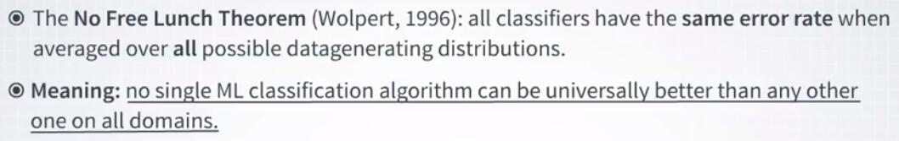
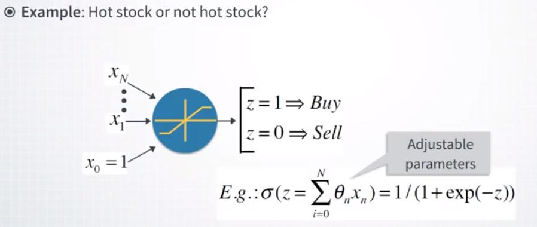
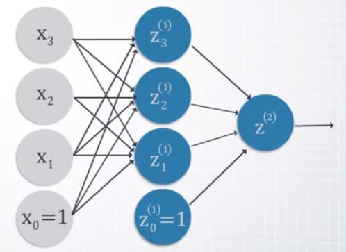
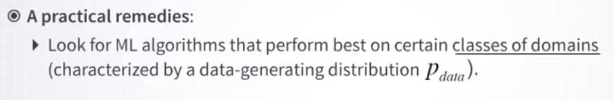

# 1.2.2 没有免费的午餐定理

不幸的是，计算机科学中存在强烈的理论负面结果，表明这是不可能的。它被称为免费午餐定理，它由大卫沃尔珀特于 1996 年建立。

无免费午餐定理说，没有一种分类算法可以普遍在所有领域优于任何其他算法。该定理的更强和更令人惊讶的表述是，当计算所有可能的数据生成分布上的平均时，所有分类算法具有相同的错误率。类似的结果适用于我们之前介绍的回归案例。这句话听起来可能非常令人惊讶，所以让我们考虑一个具体的例子。

假设我们想要制作一个我们称之为热门股票或不热门股票的分类器。分类器将采用一组预测器或特征，X1 到 XN，我们用它来进行预测。为方便起见，我在这里添加了一个常数预测器，x0 等于 1，但如果你还不知道它是什么，请不要担心。我们稍后会讨论这些技术问题。现在，分类器的输出 z 将是二元数 0 或 1。给定股票的值为 1 表示预期会超过市场，如果不是，则表示 0。我们将使用这种分类器的输出来做出我们的投资决策，以便分类器成为我们的投资顾问。

现在要从实值输入 X1 到 XN 得到 0 的 1 的二元输出 z，我们需要把这些输入放进某种非线性变换。我们可以示意性地，把这个函数表示为这种蓝色圆圈。

在这个圆圈内部，我为一个变量的情况绘制了一个非线性变换的例子。该函数将具有一些参数。至少 N + 1 个参数，因为这是我们输入变量的数量，包括我们的常量输入 x0。

这种函数的一个简单例子是这里所示的所谓 logistic 函数，其中参数将是所有特征的线性组合。这样的函数会有 N + 1 个参数，所以它很简单。这还不是二元输出，因为这样的函数会产生连续输出。但是我们将在后续视频中看到它的输出如何转换为 0 或 1 的二元值。现在，让我们继续这个例子，并假设我们微​​调这个模型的参数，以便它现在在一些大型股票数据集上训练，比如 2,000 只股票和 2000 天的观察。因此，我们总共有 400 万个观测值，每个观测值都有 50 个特征。我再次跳过如何完成此操作的详细信息。我们将在短时间内学习它，但是现在我想专注于高阶概念。因此，假设你构建了这样的分类器并通过查看数据的解析来微调其参数。

现在你有一个预测器，会告诉你的是否有任何特定股票是热门的。你现在可以使用此预测器开始交易。例如，你可以购买十个热门股票并卖出十个不热门的股票。实际上，你可能不会对策略的表现太激动，并且你会想要改进分类器。

所以现在让我们假设我们提出了如何实现的好主意。如果我们只是生成信息流水线（在这张图片上显示），会发生什么？

这里的圆圈代表了这个方框的输入的一些变换。因此，我们的整个流水线将产生非线性变换的一种不同的瀑布。

流水线将由接收输入的层组成，对它们进行非线性变换，并在架构中传递它们。

这里我只展示了两个这样的层，但原则上，我们可以在输入和输出之间的某处添加更多层。每个转换都有自己的参数。因此整个流水线将具有许多参数，并且将产生足够丰富的函数。如果我们有大量数据或许多预测器，那么在某些参数调整之后，这样的模型可能比第一个不太复杂的模型表现得更好。

事实上，我所描述的是神经网络的示意图，我们将在此专项中大量讨论它。现在让我们假设我们已经构建了这样一个更先进的模型，甚至发现它确实对我们的股票数据更有效。因此，可能因为它对于股票预测更有效，对于任何相同形状的数据，这种更复杂的模型总是比第一个更不复杂的模型更好。在我们的例子中，有 400 万行和 50 列。实际上，如果它的参数比第一个模型的参数多，那么对于任何 4 百万乘 50 的数据中心，我们是否总是不应该引用第一个模型？无免费午餐定理给出的答案是，更复杂的模型不仅不总是比简单模型更好，如果它们的表现是相同大小的所有可能数据集的比率，它们实际上将具有完全相同的错误率。

现在怎么可能，它意味着什么？它只是意味着，所有可能的数据生成机制的集合太丰富，不能被任何给定的机器学习算法充分表示，算法的泛化能力由特定的模型架构决定。例如，虽然非常大的神经网络可以在图像分类上击败任何其他模型，但是免费午餐定理可以保证更简单的模型至少对某些类型的数据更有效。现在缺乏普遍性的坏消息还是好消息？我个人认为这是一个非常好的消息，因为正是它让机器学习如此令人兴奋，并且对每个想要尝试新类型数据集和新机器学习算法的人开放。

从上述所有方面得出的另一个更实际的结论是，我们不应该寻求在所有可能的领域中普遍优于任何其他模型的机器学习模型。相反，重点应放在对特定感兴趣领域更有效的模型上。

这正是这个专项的目标之一，我们在这里探索在金融领域最有效的方法，而不是那些在其他领域发挥更好作用的方法。例如，用于图像识别。

在本文中，让我们接下来谈谈一个关键的机器学习概念，即正则化的概念。

