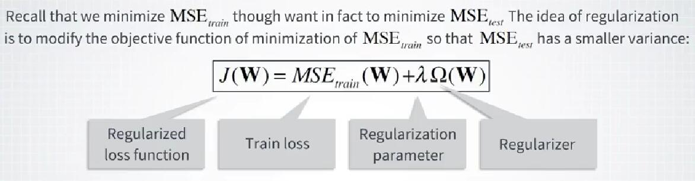
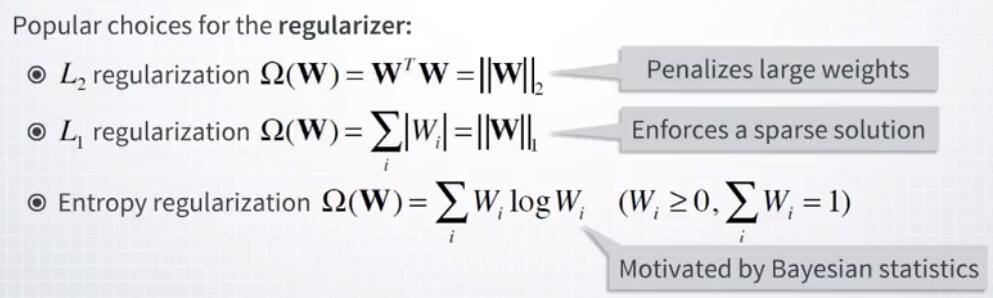
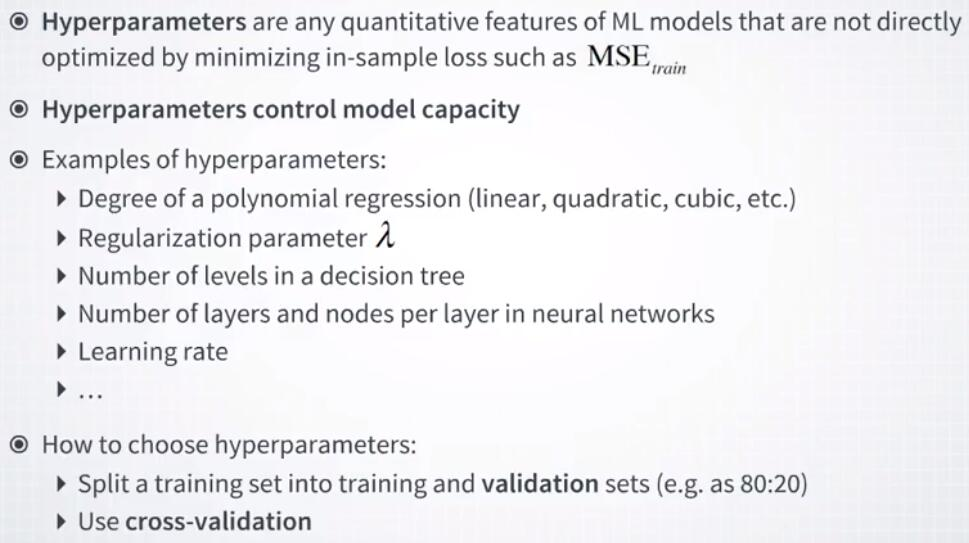
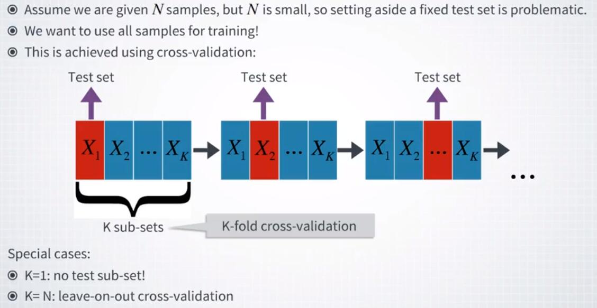
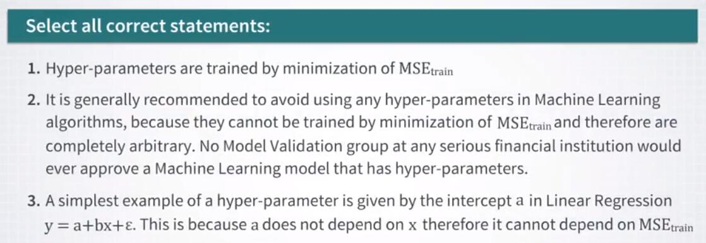

# 1.2.5 正则化、验证集和超参数

我们在上一个视频中提到，当泛化表现开始恶化时，称为正则化的过程有助于线性回归和其他机器学习算法。

现在，我们来谈谈正则化，机器学习的另一个关键概念，更详细一点。

如果我们回想起在机器学习中我们最小化训练误差，MSE train 用于回归，即使我们的主要兴趣在于 MSE test，正则化的想法也变得更加清晰。

主要思想是，通过添加模型参数的函数来修改目标函数，希望新函数能够生成具有较小方差的模型。

这里显示了我称之为 J 的这种函数。

它有两项。

第一个是熟悉的 MSE 训练损失。

注意，它是模型参数 W 和数据 X 的函数。

第二项由正则函数 omega 给出，该函数是权重 lambda 乘以输入总和。

该参数通常称为正则化参数。

注意，第二项仅是模型参数 W 的函数，而不是输入 X 的函数。

现在，这个新项的影响既取决于 W 的形式，也取决于正则化参数 lambda 的值。

如果 lambda 接近零，我们回到最初的情况，没有任何正则化。

另一方面，如果 lambda 非常大，那么优化器将忽略第一项所有并且将尝试最小化第二项。

因为第二项完全不依赖于数据，所以所得到的解决方案，将简单由 W 的一种正则化器一次性固定，而不管实际数据如何。

对于 lambda 的任何中间值，模型参数的结果值将介于将在这两个限制情况下获得的值之间。

这种情况是我们所需要的。

我将在几分钟内解释我们如何选择 lambda 的最佳值，但首先让我向你展示机器学习中常用的正则化器的一些流行示例。

第一个常见的正则化器，就是向量 W 的 L2 范数的平方。

这种正则化器的回归问题称为岭回归。

它的作用是试图找到权重不会太大的解决方案。

另一个流行的正则化器是向量 W 的 L1 范数。

这被称为 L1 或 LASSO 正则化，并且事实证明这种正则化强制了解决方案的稀疏性。

当权重应该是非负的并且总和为 1 时，有时使用的另一种正则化是所谓的熵正则化，这在此处示出。

这种正则化源于贝叶斯统计。

我们将在本专项的下一个课程中更深入地讨论正则化方法。

但就目前而言，如果你已经决定使用正确的正则化项，我想讨论如何选择 lambda 的最佳值。

正则化参数将是我们所谓的超参数的第一个例子。

我们将在此专项中看到更多超参数的例子，但那些超参数是什么？通常，超参数是机器学习算法的任何定量特征，它们不通过最小化训练或样本内损失，诸如 MSE train，而直接优化。

超参数的主要功能是控制模型容量，即模型逐步拟合更复杂数据的能力。

回归超参数的一个例子是用于回归的多项式的次数，即它是线性的，二次的，三次的等等。

我们刚刚介绍的正则化参数 lambda 是另一个常用的超参数。

超参数的其他示例包括，决策树中的层数或神经网络中的层数或每层的节点数。

一些参数将提供一些进一步的例子，这些参数决定了模型拟合新数据的速度。

这些参数称为学习率，适当的选择在实践中通常非常重要。

所有这些超参数之间的共同点，是它们通常使用两种方法之一来选择。

第一种方法非常简单。

我们只是将训练集分成一个较小的训练集和一个称为验证集的集合。

例如，你可以为验证集留出约 20% 的训练数据。

我们的想法是使用新的训练集来调整模型的参数，然后使用验证集来调整超参数。

调整参数和超参数时，使用测试集评估模型的最终表现，方法与之前相同。

这种方法很简单，理论上也很可靠，但是当数据集很小时，它可能并不理想。

在这种情况下，为验证集留出一些数据可能是不合需要的，因为它可能导致样本的准确性更差。

为了应对这种情况，使用了一种称为交叉验证的方法。

与第一种方法不同，交叉验证方法在训练期间不会丢弃任何信息。

这就是交叉验证的工作原理。

假设我们有 N 个样本可用于训练但 N 很小，因此留出一部分数据是有问题的。

那么，我们做的是以下几点。

首先，我们定义一些超参数的可能值的集合。

例如，我们想要优化的正则化参数 lambda。

通常，这被定义为一小部分可能的值，因此我们只想从一组候选值中选择最佳值。

接下来，我们将整个训练数据集划分为大小相等的 k 个块，X1 到 Xk。

然后我们启动以下循环过程，我们对我们的候选值集合中的正则化参数的所有值重复这些过程。

首先，我们将第一个块拿出来，并在其余的训练数据上训练我们的模型。

完成后，我们使用超参数的当前值和坐标值来评估块 X1 的模型误差。

因此，到目前为止，它看起来与基于验证集的方法完全相同，但不同之处在于我们的下一步。

记录完样后，第一个块获取的样本误差后，我们把它放回训练集并取出我们的下一个块，X2。

然后我们重复上面的所有步骤，即我们用块 X1，X3 等等训练模型，然后在块 X2 上运行训练的模型，并记录估计的样本外误差。

然后，我们继续此循环过程，并计算在按序取出所有块时获得的平均样本外错误。

我们分别针对我们想要尝试的超参数的所有可能值执行此过程，并且超参数的最佳值将是提供样本误差的最小平均值的值。

我所描述的称为 K 折交叉验证，其中 K 代表我们对训练数据集进行划分的块数。

这里有一些特殊情况值得一提。

首先，如果我们让 K 等于 1，那么显然在这种情况下我们将不会有任何保留的块。

所以，这个案例对我们的目的来说并不是很有意思。

其次，如果我们将 K 等于 M，我们得到了交叉验证的限制情况，称为留一交叉验证。

在这种情况下，在我们的循环过程的每个步骤中，我们只有一个数据点不用于估计模型，因此可用于样本外测试。

这种留出式交叉验证在实践中很少使用，因为一旦你的数据集变得相当大，它就会变得非常耗时。

一个更受欢迎的选择是使用 10 折或 5 折的交叉验证，其中块的数量分别为 10 或 5。

调整超参数通常是构建机器学习算法的一个非常重要的部分，这也可能是非常耗时的部分，特别是如果你有很多超参数或者你没有它们的良好猜测。

因此，它需要广泛的可能值。

我们将在专项的许多部分进行此类分析，包括监督学习，无监督学习和强化学习等主题。

总结一下本课程，我们已经涵盖了机器学习的许多重要概念，例如过拟合，偏差方差分解，正则化和超参数调整的问题。

在下一课中，我们将开始了解，这些概念如何应用于，可以使用监督学习方法解决的现实世界金融问题。

