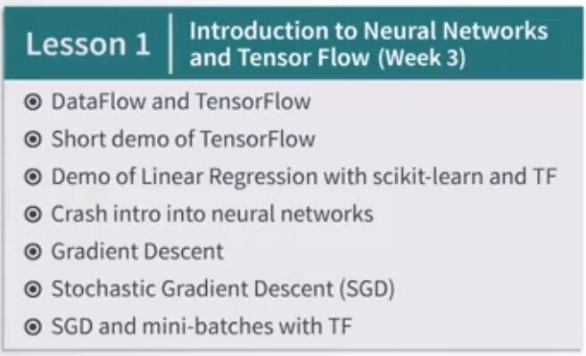
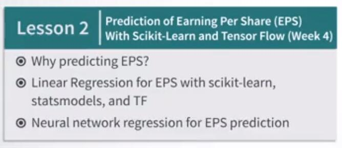
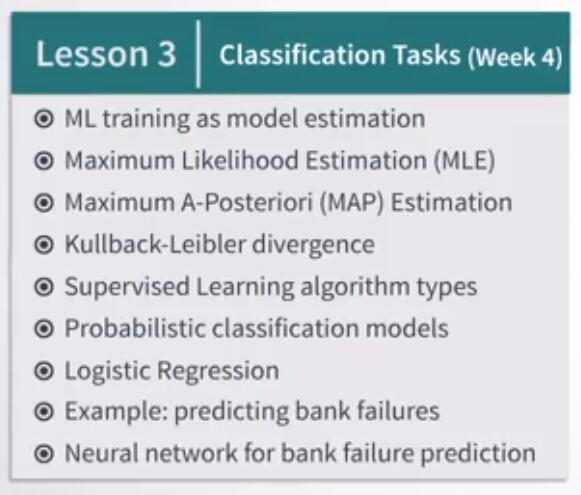

# 1.2.6 金融中的监督学习概览

俗话说，如果你有锤子，一切看起来像钉子。这正是本周末你会得到的。你会得到那台机器学习之锤。

锤子是与 TensorFlow 相结合的神经网络，TensorFlow 是一个功能强大的机器学习（符号计算）库，由 Google 于 2015 年 11 月开源。

你可能以前曾听说过或使用过这些工具。但如果没有，那么我认为现在就可以了解这些工具。所以这就是你将在本周学到的东西。让我们从本周的第一课开始吧。首先，你将通过我们的主要工具 TensorFlow 熟悉本课程。我们将首先回顾一下 TensorFlow 如何实现所谓的计算图。

然后我们将打开我们的第一个 TensorFlow Jupyter 笔记本，通过查看非常简单的操作，来了解这些内容是如何工作的。

接下来，你将看到 TensorFlow 如何实现简单的线性回归，并将其与其他 Python 包的完成方式进行比较。之后，你将了解神经网络的组织方式，以及线性回归为何只是一个非常特殊和简单的神经网络。

你还将看到为什么神经网络可以被视为一种机器学习之锤。

了解神经网络后，你将了解用于训练的方法。在这里，你将会遇到现代机器学习的一些主力课程，即梯度下降法及其变体，如随机梯度下降。我们将看到他们在理论和实践中都怎么用，也就是说，在幻灯片和 Jupyter 笔记本中一起。在这里，我们将首先看到，它在线性回归中的原理，然后在 TensorFlow 中实现神经网络回归。所有这些都将使用一些简单的非金融数据来完成，这样我们就不会同时在几个新主题中迷失。

所有这些主题将在第一课中介绍。然后在我们得到如此强大的锤子后，我们将开始寻找金融的钉子。你会看到的第一个钉子是一个非常经典的金融问题，即预测每股收益或简称 EPS 的问题。

一旦我们拥有 TensorFlow 和其他软件包（如 scikit-learn 和 statsmodels ）之类的工具，我们就可以尝试对此问题进行线性和非线性神经网络回归。之后，我们将转向分类方法。我们将首先看看机器学习如何处理概率模型。然后我们将讨论最大似然估计和相关方法，如最大后验方法。

我们还将讨论相对熵的概念，也称为 KL 散度，这对理解机器学习非常重要。

然后你会看到，所有这些机器如何应用于分类问题。你将了解最强大的分类方法之一，称为逻辑回归。你还将学习如何在 scikit-learn 和 TensorFlow 中实现它。你将看到另一个特例，逻辑回归是如何被称为神经网络的通用锤子。最后，我们的锤子将找到第二个金融的钉子，这将成为预测银行破产的问题。正如你将看到的，我们的锤子对于这种类型的钉子来说非常好。所以这就是你将在本周掌握的内容。
