# 1.2.8 TensorFlow 的第一个演示

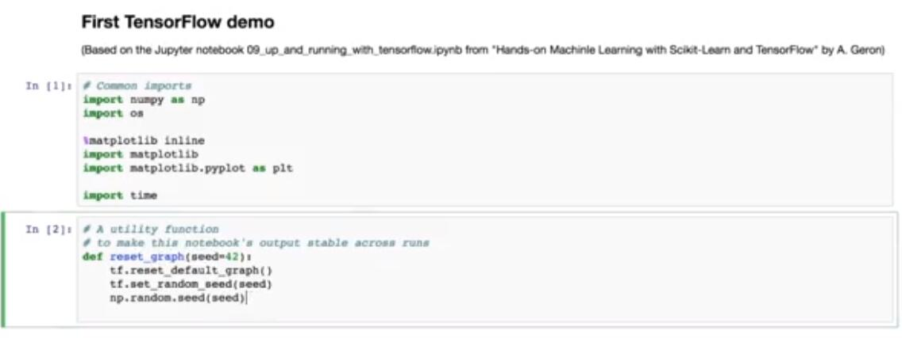

作为我们可以做的第一件事，我们启动下面的单元格，我们通过使用此函数，在默认图中创建它。然后我们为两个变量 x 和 y 创建三个节点。而且一个常量。它们将分别通过值 3,4 和 2 初始化。现在，让我们检查一下我们创建的节点是否确实在默认图上。很好，就是这样。

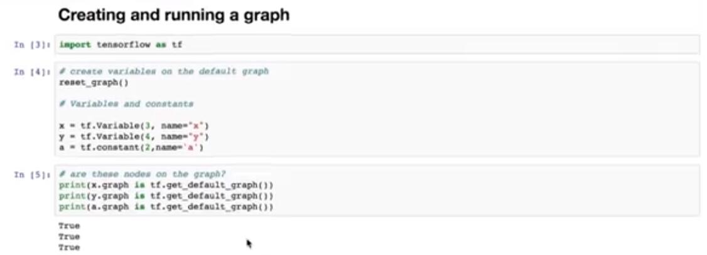

作为旁注，我想告诉你，节点也可以在其他图上创建。这是一个注释的例子，X2 是在名为 Graph 的图上创建的。如果我们求值这些语句，那么这就是我们将要看到的。现在，让我们求值一下这个单元格，看看我们刚刚创建的节点是否尚未初始化。

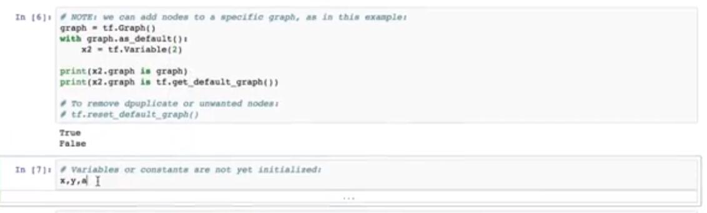

下一个单元格，我们定义一个函数 f 等于 x 平方加 y 加 a。我们来求值单元格。如果我们现在固定 f 的值，我们会看到它是类型为`add`的 Tensor。还没有 f 的值，这是 TensorFlow 中延迟求值的一个例子。

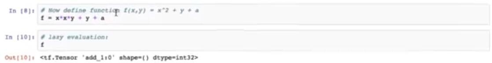

现在，在 TensorFlow 中运行我们的第一个图表，一切都准备好了。为此，我们需要启动 TensorFlow 会话。在我们打开一个会话之后，我们必须在这里和这里初始化变量，然后运行我们的函数。请注意，无需在 TensorFlow 中初始化常量。

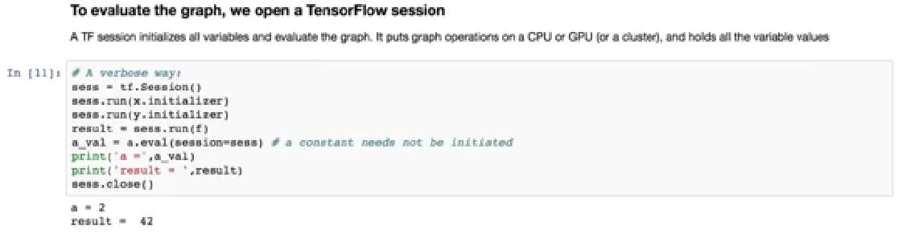

会话结束后，我们应该使用此命令手动关闭它。让我们运行它来查看结果。结果就是这样。有一种更方便的方法，可以使用`with`结构来自动关闭会话，如此单元格所示。

最后，如果我们在这里引入一个新节点，整个代码可以更短。这样可以同时处理所有标签的初始化。以下是我们如何使用它。因此，如果我们运行此单元格，我们再次看到相同的结果。要检查 TensorFlow 创建的节点，我们可以在此处键入`init`。结果就是这样。我们的下一个插图显示了节点值的生命周期。创建节点时，它仅仅向运行 TensorFlow 会话时的执行阶段添加值。让我们考虑这个例子。这里我们创建一个常数 w 等于 3 的节点，然后我们创建三个 x，y 和 z。

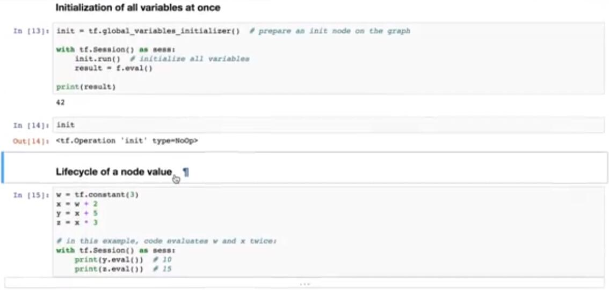

我们假设我们想要计算 y 和 z 的值。一种方法就是在单元格中显示。

在这种情况下，TensorFlow 图将反转两次，以便彼此独立地计算 y 和 x 的值。即使 y 和 z 都使用相同的 x 值。

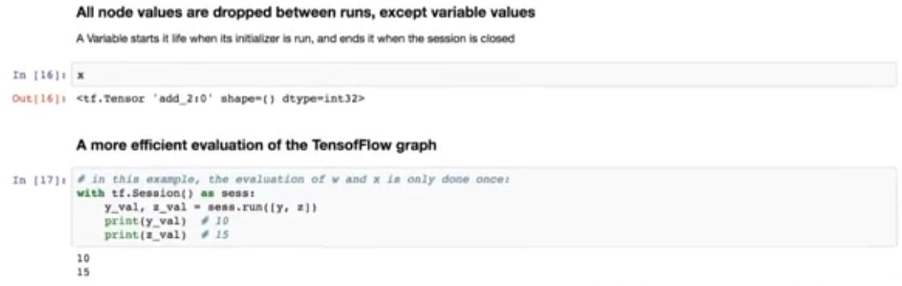

重要的是要记住，在图的不同行之间，所有节点值会删除。此规则的唯一例外是变量，它们在初始化为代码时开始生命周期，并在会话关闭时结束。

因此，在运行单元格之后，我们可以再次检查节点 x 的状态，然后再次看到初始化的图。此外，这里代码同时改变 w 和 x 两次，来计算 y 和 z，来分离图的 trans。通过告诉 TensorFlow 在一个解析中完成图上所有计算，可以更有效地完成此操作。此单元格中显示了此语法。这是我们的做法。

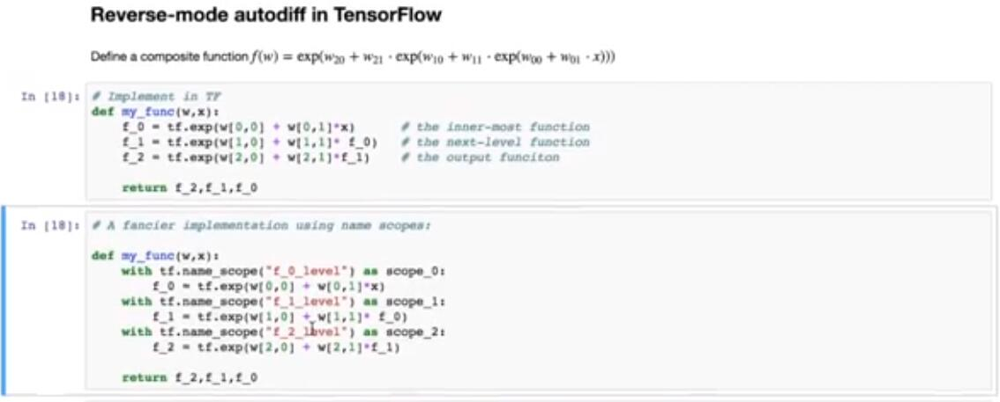

如果我们求解它，我们会得到相同的结果。接下来，我想演示 TensorFlow 中反向模式自动微分的工作原理。让我们考虑一下这里显示的函数。它是指数的指数的指数。这个函数实际上非常类似于我通过神经网络实现的损失函数。因此，此示例可能对你理解 TensorFlow 中神经网络的工作非常有用。让我们看看我们如何实现这个函数。这非常简单，并在此单元格中显示。这里，我们首先定义输入单元的 Tensor 值输出，然后将其用作输入来计算第二层的输出。最后，使用最后一个输出来生成函数的值。我们将这三个值作为函数的输出返回。这是在单元格上。我们还可以在其上面进行一些综合探索，并在其自己的范围内定义每个层，就像在此单元格中显示的一样。

这对于 TensorFlow 图的可视化以及它属于何处有用。现在，让我们指定一个你想要计算导数的点。我想找到一个点，所有截距都等于零，所有斜率都是 1。

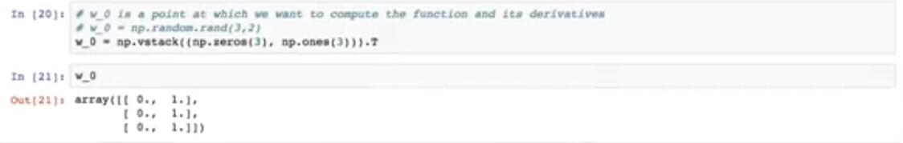

让我们在这里实现并验证我们得到了什么。这是正确的点。接下来，我们分析计算所有导数，在这里展示。你可以使用此视频的铅笔中的节点，详细了解多个计算。但就目前而言，让我们看看 TensorFlow 如何计算这些导数。

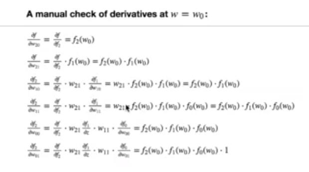

所以我们清除图表再次从头开始，并通过变量节点 w 和 x 创建，两者都是浮点类型，然后我们调用我们的函数。并且（？）所有层的值，f2，f1 和 f0。

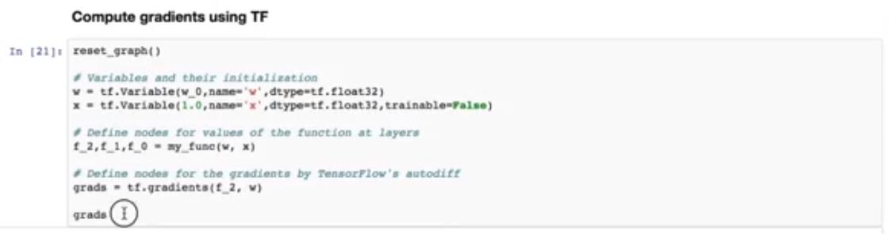

下一行是行 Q。在这里，我们定义了节点，用于外部函数 F2 对于所有参数 w 的梯度。

所以让我们求解它，并看到它返回的张量。这里的求解只需通过调用`tf.gradients`完成，其中包含两个参数，函数的名称 f2 和我们要调用来计算梯度的变量。

现在，让我们转到下一个单元格。这是我们运行 TensorFlow 图的地方。

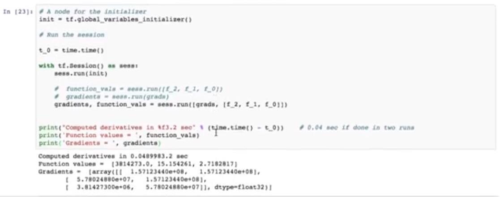

我们可以运行它两次，来首先计算函数值，然后计算梯度值。或者我们选择此处注释的代码，或者我们可以使用之前显示的相同语法在一次运行中完成。

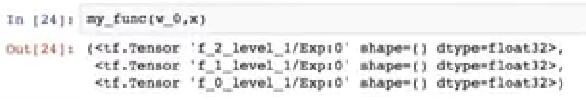

让我们运行它。我们有梯度，我们有六个用于梯度的数字，跟着自由参数的数量，你可以使用上面给出的公式检查，并手动检查这些是正确的数字。现在，我们检查会话结束后，函数再次返回张量的未初始化值。

最后，我想向你展示如何可视化 TensorFlow 图。有两种方法可以做到。在 Jupyter 笔记本中或使用 TensorBoard。在这里，我将向你展示第一种方法。这个矩阵来源是在这个单元格中给出的，这是我从 Garren 的书中借来的代码。所以，让我们运行它，然后移动到下一个单元格，在那里我们显示一个图。让我们来吧。我们为代码输出了 TensorFlow 图。

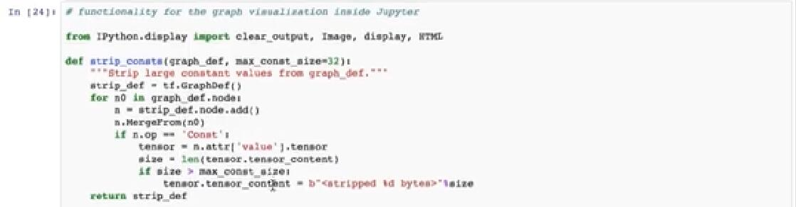

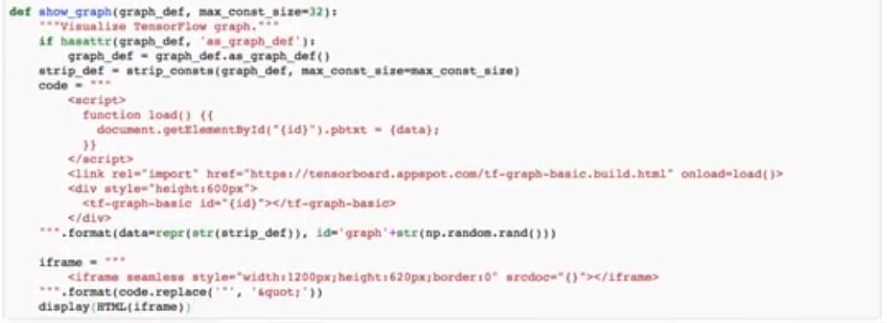

现在，你可以看到为什么我们在函数定义中引入了这个名称范围。 TensorFlow 将所有名称范围放在像这样的单独框中。我们可以点击它们并查看这些框内的操作。等待我们的演示，我将向你展示如何运行 TensorBoard 来可视化图，以及如何在此处查看不同训练算法的表现。这就是我们将要看到的。

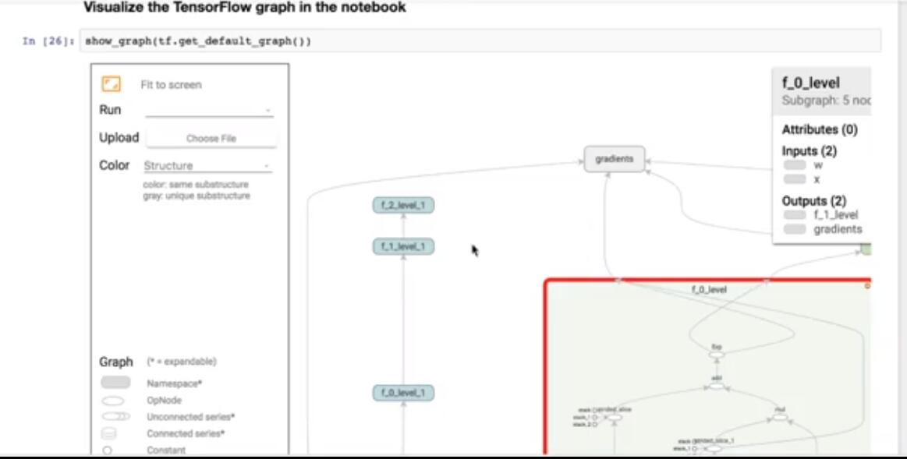
